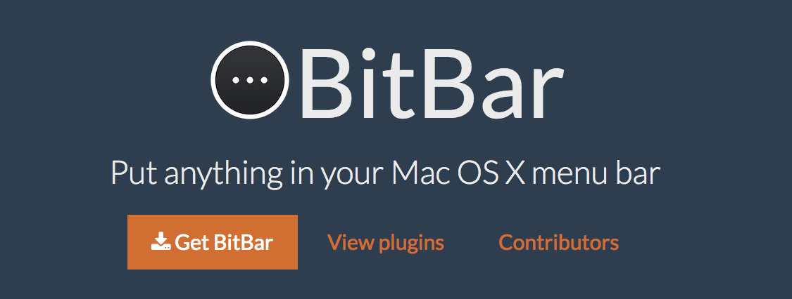
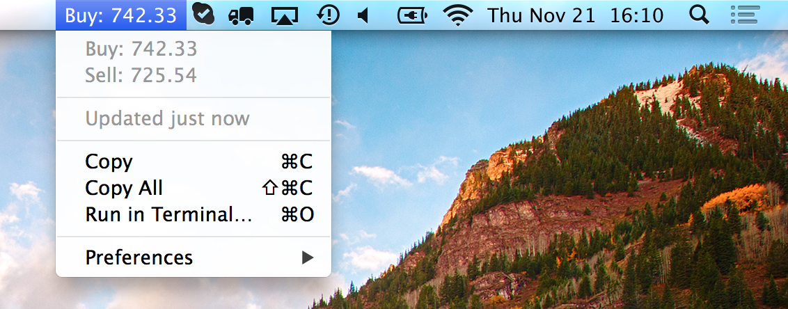
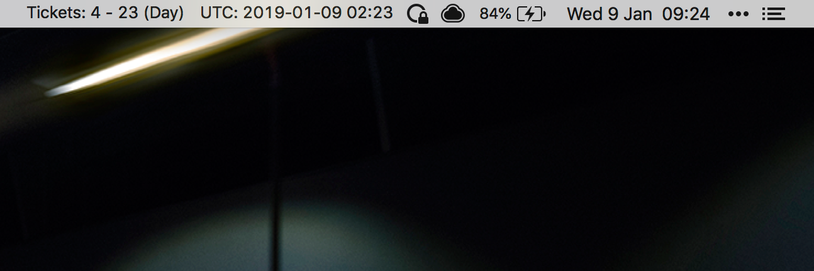

## The Problem

@css[fragment](Too much information.)

@img[fragment](https://media.giphy.com/media/3o6gDSdED1B5wjC2Gc/giphy.gif)

---

## The Problem

@css[fragment](How can we more easily consume the information we're *interested* in?)

@css[fragment](So we can take *action* on it.)

@css[fragment](And help prevent...)

@img[fragment](https://media.giphy.com/media/R0kVcQUow2Xtu/giphy.gif)

---

## More Specifically

@css[fragment](I wanted to know...)

@css[fragment](How many Tickets have I replied to?)

@ul[square]
- This hour
- Todat
- This week
@ulend

@css[fragment](Am I hitting targets? *Am I doing OK?*)

---

## One Potential Solution



---

## What is BitBar?

BitBar lets you put the output of any script or program right in your Mac's Menu Bar



---

## How can BitBar help?

@css[fragment](The MacOS Menu Bar is a convenient and accessible place to display information)

@css[fragment](BitBar lets *you* choose the information *you want to see* in the Menu Bar)

@css[fragment](You can tell BitBar *when* to update the information it displays in seconds. Choose in minutes, hours or even days.)

---

## How does BitBar work?

@css[fragment](Write a simple script or run a program which outputs something)

@css[fragment](Use pretty much any language you like)

---

## How does BitBar work?

It could be as simple as...

```bash
echo "Hello Zapier!"
```

---

## How does BitBar work?

Or something a little more useful...
@size[0.5ems](
```bash
# Help Scout reply data variables
declare help_scout_replies_week=$(curl -s -u $help_scout_api_key:X "$help_scout_url?start=$start_date_this_week&end=$end_date_this_week&viewBy=day&user=$help_scout_user_id")
declare help_scout_replies_hour=$(curl -s -u $help_scout_api_key:X "$help_scout_url?start=$start_date_this_hour&end=$end_date_this_hour&viewBy=day&user=$help_scout_user_id")

# Help Scout reply count variables (extracted from JSON API response data using 'jq')
declare count_hs_replies_week=$(echo $help_scout_replies_week | /usr/local/bin/jq -j -s 'map(.current[].replies) | add')
declare count_hs_replies_day=$(echo $help_scout_replies_week | /usr/local/bin/jq -j ".current[] | select(.date==\"$date_today_zero_hours\").replies")
declare count_hs_replies_hour=$(echo $help_scout_replies_hour | /usr/local/bin/jq -j '.current[0].replies')

echo "Tickets: Hour $count_hs_replies_hour - Day: $count_hs_replies_day -  Week: count_hs_replies_week | size=12"
```
)

---

## How does BitBar work?

Anything that can write to *standard out* is supported, so you can use Shell scripting, Python, JavaScript, Ruby, Shell, and more...

---

## Useful things you can do

Get some data from a REST API

```bash
# 'curl' is a command-line tool for transferring data from or to a servers
curl https://api.helpscout.net/v1/reports/user/replies.json
```

---

## Useful things you can do

Transform that data (query it, do math on it)

```bash
# 'jq' is a command-line tool for transforming JSON data
cat data | jq -j ".current[] | select(.date==\"$date_today_zero_hours\").replies"
```

---

## Useful things you can do

Make pretty graphs from the data

```bash
# gnuplot is a command-line tool for generating graphs
cat data | gnuplot -p -c plot.gnu
```

---

## Useful things you can do

Then display all that information in the Menu Bar

---

## How I use BitBar

@css[fragment](Simple script which shows me the time now in UTC)

@css[fragment](*Find this really helpful when looking in Graylog*)

@image[fragment](template/img/timestamp-napkin.png)

---

## What I've been working on (TicketBar)




## What I'm aiming for


---

## Over to you

- Install it
- Install some plugins
- Check out the BitBar docs
- Build something yourself
- Or help me with TicketBar!

---

## Resources

-- BitBar
-- BitBar (GitHub)
-- BitBar Plugins
-- TicketBar (GitHub)

---

## Questions?